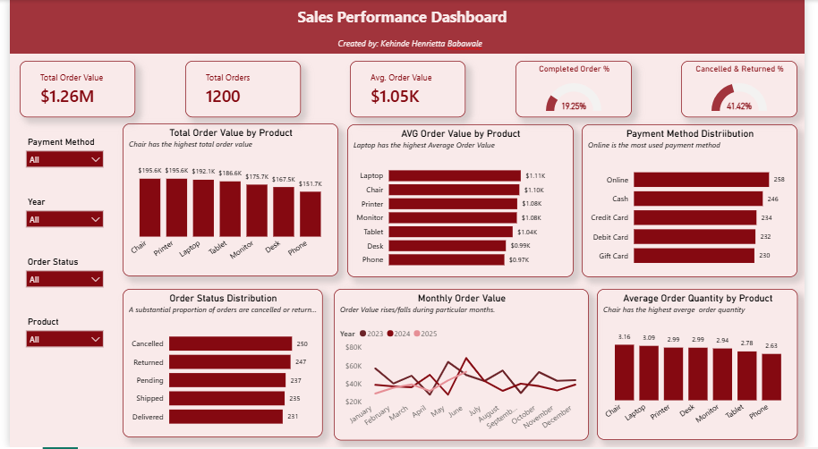

# Sales Performance Dashboard


## Project Overview

This project was completed as **Project 4 of my DecodesLab Data Analytics Internship**, with a focus on **Data Visualization and Business Intelligence**.

The goal of the project was to transform previously analyzed sales data into an interactive dashboard that communicates key business performance metrics, product performance, order behavior, payment preferences, and revenue trends clearly and effectively.

The dataset used in this project is the same dataset previously analyzed using **Python for Exploratory Data Analysis (EDA)** and **SQL for business analysis**.

---

## Project Objective

The primary objective was to:

* Transform analytical findings into meaningful visualizations
* Track key sales performance indicators
* Identify top-performing products
* Analyze order status and completion patterns
* Examine customer payment preferences
* Analyze monthly revenue trends across multiple years
* Create an interactive dashboard for business decision-making

---

## Tools & Technologies

* **Power BI** – Dashboard development and interactive visualization
* **Power Query** – Data preparation and transformation
* **DAX** – KPI and calculated measure creation
* **SQL** – Previous business analysis and data aggregation
* **Python** – Previous exploratory data analysis
* **Microsoft Excel** – Source dataset

---
## Dashboard Preview

The completed dashboard provides a single-page view of sales performance, combining KPIs, product analysis, payment behavior, order status, purchasing quantity, and monthly trends.



## Dashboard KPIs

The dashboard provides an overview of key business performance indicators:

| KPI                        |      Value |
| -------------------------- | ---------: |
| **Total Order Value**      | **$1.26M** |
| **Total Orders**           |  **1,200** |
| **Average Order Value**    | **$1.05K** |
| **Completed Order %**      | **19.25%** |
| **Cancelled & Returned %** | **41.42%** |

These KPIs provide a quick overview of overall sales performance and order health.

---

## 📊 Dashboard Visualizations

### 1. Total Order Value by Product

A bar chart comparing the total order value generated by each product.

**Key insight:**
**Chair** generated the highest total order value at approximately **$195.6K**, followed closely by **Printer ($195.6K)** and **Laptop ($192.1K)**.

---

### 2. Average Order Value by Product

This visualization compares the average value of orders across products.

**Key insight:**
**Laptop** recorded the highest average order value at approximately **$1.11K**, followed by Chair at approximately **$1.10K**.

---

### 3. Payment Method Distribution

This chart shows the number of orders made through each payment method.

**Key insight:**
**Online payments** were the most frequently used payment method, with **258 orders**, followed by Cash with 246 orders.

---

### 4. Order Status Distribution

This visualization shows how orders are distributed across the five order-status categories:

* Cancelled
* Returned
* Pending
* Shipped
* Delivered

**Key insight:**
Cancelled and returned orders account for a substantial proportion of total orders, with the combined **Cancelled & Returned rate at 41.42%**.

---

### 5. Monthly Order Value Trend

A line chart showing monthly order value across **2023, 2024, and 2025**.

The **Year legend** allows year-to-year comparison and helps identify changes in monthly performance and seasonal patterns.

> **Note:** The 2025 dataset covers only part of the year, so direct comparison of full-year totals with 2023 and 2024 should be avoided.

---

### 6. Average Order Quantity by Product

This visualization compares the average quantity purchased for each product.

**Key insight:**
**Chair** had the highest average order quantity at approximately **3.16 units per order**, followed by Laptop and Printer.

---

## Interactive Features

The dashboard includes slicers that allow users to filter the analysis dynamically by:

* **Payment Method**
* **Year**
* **Order Status**
* **Product**

These filters allow users to investigate specific aspects of sales performance without changing the underlying visuals.

---

## Key Business Insights

Some of the major insights identified from the dashboard include:

### Strong Product Performance

Chair was the leading product by total order value, while Laptop recorded the highest average order value.

### Online Payments Lead

Online payment was the most frequently used payment method, indicating a strong preference for digital transactions.

### High Cancelled & Returned Orders

The combined cancelled and returned order rate was **41.42%**, highlighting an area that may require further investigation into fulfillment, product quality, customer expectations, or delivery processes.

### Quantity Differences Across Products

Chair recorded the highest average quantity purchased per order, suggesting stronger volume per transaction compared with some other products.

### Revenue Fluctuates Over Time

Monthly order value varied across the three years, providing opportunities to investigate seasonal patterns and periods of stronger or weaker performance.

---

## Project Workflow

This project was part of a broader data analytics workflow:

```text
Raw Dataset
     ↓
Data Cleaning & Transformation
     ↓
Python Exploratory Data Analysis
     ↓
SQL Business Analysis
     ↓
Power BI Data Modeling & DAX
     ↓
Interactive Sales Performance Dashboard
```

The previous **Python and SQL analyses** provided the insights that guided the selection of visuals for this dashboard.

---

## Key Skills Demonstrated

Through this project, I strengthened my ability to:

* Create interactive Power BI dashboards
* Select appropriate visualizations for different analytical questions
* Build and format KPI cards
* Create calculated measures using DAX
* Use slicers for interactive analysis
* Analyze product performance
* Analyze order status and payment behavior
* Visualize time-series trends
* Apply data storytelling principles
* Translate analytical findings into business insights

---

---

## 👩🏽‍💻 Author

**Kehinde Henrietta Babawale**

Data Analytics Intern | Python | SQL | Power BI | Excel

**DecodesLab Data Analytics Internship – Project 4**

---

⭐ **If you found this project interesting, feel free to explore the repository and connect with me!**
